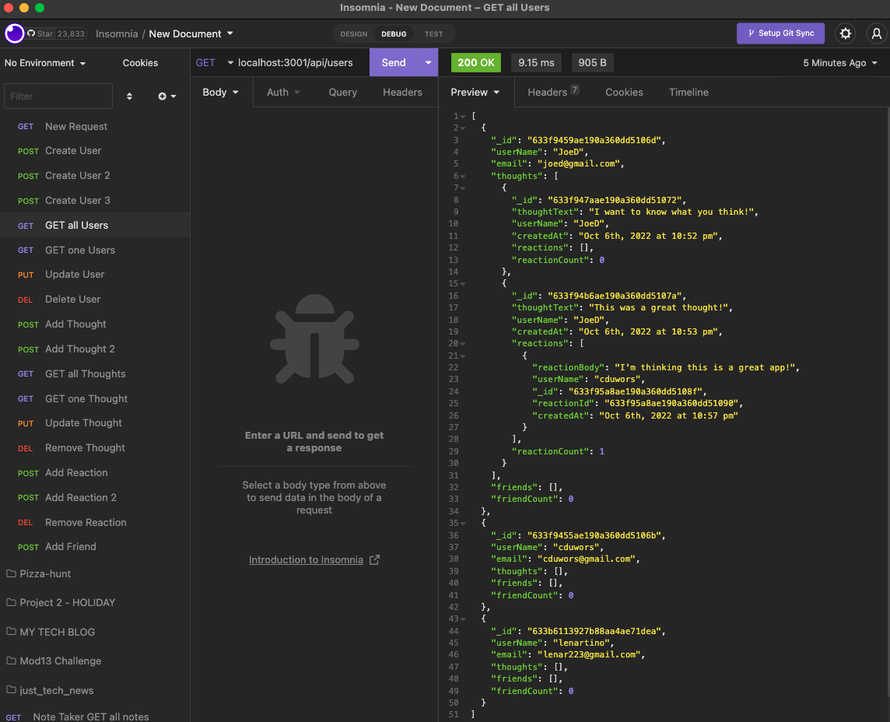

# social-media-api

## Description

This is a basic MVC back end for a social media API. It is built utilizing `Express.js`, `MongoDB`, and `Mongoose`. The application functionality is as follows:

GIVEN a social network API

WHEN I enter the command to invoke the application

THEN my server is started and the Mongoose models are synced to the MongoDB database

WHEN I open API GET routes in Insomnia for users and thoughts

THEN the data for each of these routes is displayed in a formatted JSON

WHEN I test API POST, PUT, and DELETE routes in Insomnia

THEN I am able to successfully create, update, and delete users and thoughts in my database

WHEN I test API POST and DELETE routes in Insomnia

THEN I am able to successfully create and delete reactions to thoughts and add and remove friends to a user’s friend list

View live demo here Live Demo: https://drive.google.com/file/d/117nYU-muhusLgFn7SUXRUPwNWH1cQVwC/view .

## Table of Contents

- [Installation](#installation)
- [Usage](#usage)
- [Issues](#issues)
- [License](#license)
- [Contributing](#contributing)
- [Questions](#questions)
- [Images](#images)

## Installation

You can install this by downloading the code from my GitHub repository. See the link below in the [Questions](#questions) section.

## Usage

Expected use is:

AS A social media startup

I WANT an API for my social network that uses a NoSQL database

SO THAT my website can handle large amounts of unstructured data

## Issues

The friending capability still needs to be developed.

## License

This project is not currently licensed.

## Contributing

You can contribute to this project by either:

- contacting me and collaborating with your ideas on how to make it better! OR
- downloading the code, updating with your own ideas, and then sending me a pull request for review!

## Questions

See more details at https://www.github.com/cduwors or contact cduwors@mail.com.

GitHub Repository: https://github.com/cduwors/social-media-api

## Images

Insomnia input sample

